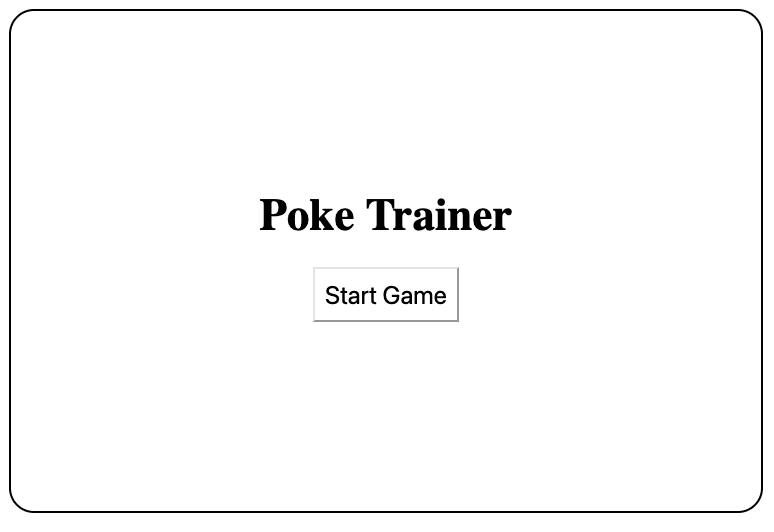
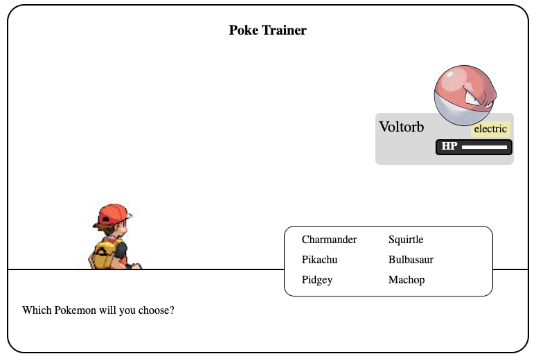
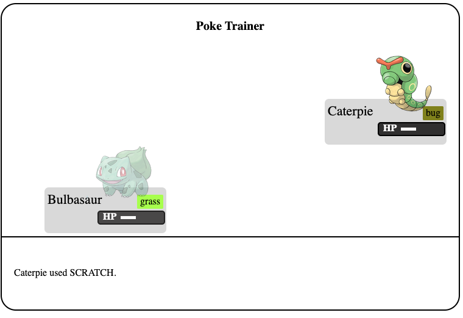
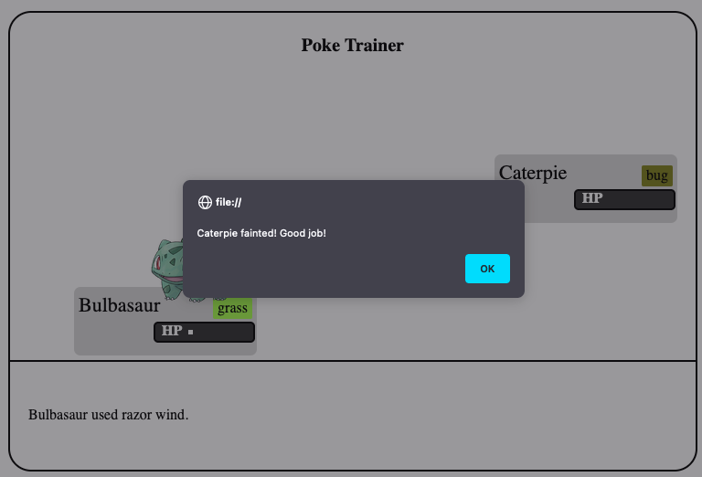
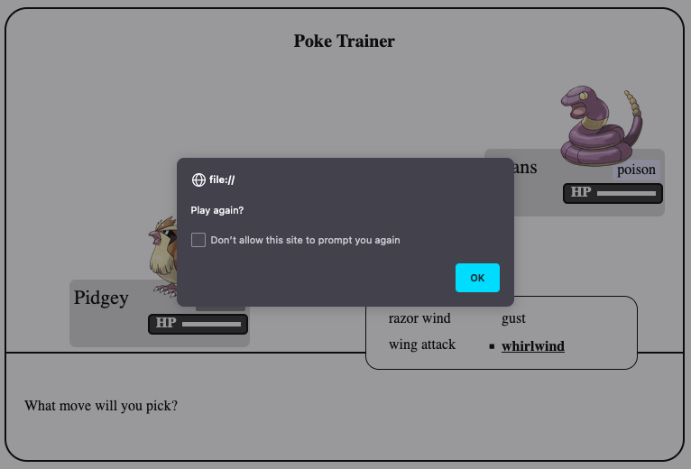

# Poké Trainer

Poké Trainer is a battle simulator. The goal of the simulator is to teach you the importance of Pokemon and move types.

## Images of working App







## Technologies

- HTML
- CSS
- JavaScript
- [Pokemon API](https://pokeapi.co/)

The game uses HTML, CSS, and Vanilla JS. Only the start screen is displayed using HTML. All other elements are displayed and/or created through DOM manipulation. Pokemon data was obtained from the PokeAPI.

## Game Link

[Click here](https://gongt108.github.io/poke-trainer/)

## Getting Started

Fork and clone repository into your Desktop. Run index.html either in your Terminal or text editor.

## Approach Taken

The main objective of the game is to learn how different move types affect different Pokemon types, which is reflected in the attack logic and supported by the win condition. Choose poorly and you will not only deal less or no damage but also receive more damage. Making too many poor decisions will lead to a loss.

Once the main objective was accomplished, I focused on the player experience. I added attack animation so that the player understood what was happening while the code ran in the background.

## Code Snippets

### Fetching Pokemon

The following code snippet retrieves the data from the Pokemon API and separates the results onto either my team or enemy Pokemon.

```javascript
function fetchPokemon(pokemon, pokemonArray) {
	fetch(`https://pokeapi.co/api/v2/pokemon/${pokemon}`)
		.then((response) => {
			return response.json();
		})
		.then((data) => {
			const newPokemon = new Pokemon(
				data.name,
				data.sprites.other['official-artwork'].front_default,
				data.moves.splice(0, 4),
				data.types[0].type.name
			);

			pokemonArray.push(newPokemon);
		})
		.catch((error) => {
			console.log('error fetching data', error);
		});
}
```

### Get Type Color

Each Pokemon type gets it's own background color. The following code utilizies a switch-case instead of an if-else. Less code needs to be written, and the spacing makes the code easier to read.

```javascript
let pokemonTypeColor = 'palegoldrenrod';

switch (selectedPokemon.type) {
	case 'poison':
		pokemonTypeColor = 'lavender';
		break;
	case 'ghost':
		pokemonTypeColor = 'purple';
		break;
	case 'normal':
		pokemonTypeColor = 'grey';
		break;
	case 'electric':
		pokemonTypeColor = 'palegoldrenrod';
		break;
	case 'water':
		pokemonTypeColor = 'lightskyblue';
		break;
	case 'fire':
		pokemonTypeColor = 'orangered';
		break;
	case 'grass':
		pokemonTypeColor = 'greenyellow';
		break;
	case 'flying':
		pokemonTypeColor = 'skyblue';
		break;
	case 'fighting':
		pokemonTypeColor = 'brown';
		break;
	case 'bug':
		pokemonTypeColor = 'olive';
		break;
	default:
		pokemonTypeColor = 'grey';
}

pokemonType.style.backgroundColor = pokemonTypeColor;
```

### Attack Animation

The following code snippet adds animation to the Pokemon is getting attacked.

```javascript
function addAttackAnimation(pokemon) {
	attackAudio.play();
	let healthBar = document
		.querySelector(`.${pokemon}`)
		.querySelector('.health-bar-container');
	let pokemonImage = document
		.querySelector(`.${pokemon}`)
		.querySelector('.pokemon-img');

	pokemonImage.parentNode.append(slashImg);
	slashImg.style.animation = 'slashed 1s';

	healthBar.style.animation = 'flicker 0.75s';
	healthBar.style.animationIterationCount = '2';

	pokemonImage.style.animation = 'flicker 0.5s';
	pokemonImage.style.animationIterationCount = '3';

	setTimeout(() => {
		pokemonImage.parentNode.removeChild(slashImg);
		slashImg.style.animation = '';
	}, 1000);
	setTimeout(() => {
		healthBar.style.animation = '';
		pokemonImage.style.animation = '';
	}, 2000);
}
```

## Unsolved Problems

- Using the keydown event to select menu options

## Future Enhancement

- Find an API that contains the type weaknesses so that it doesn't have to be hard coded into the JS file.
- Allow users to select their own pokemon in battle
