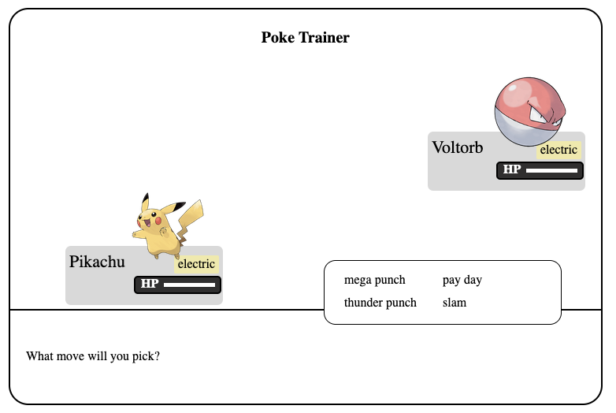
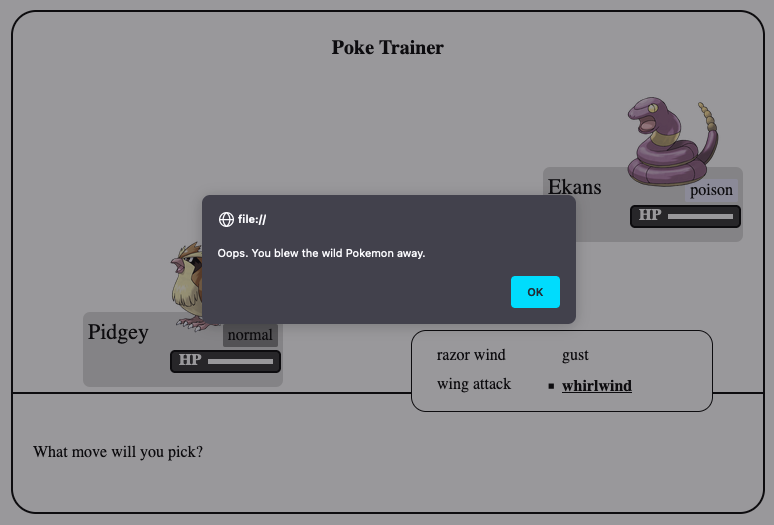
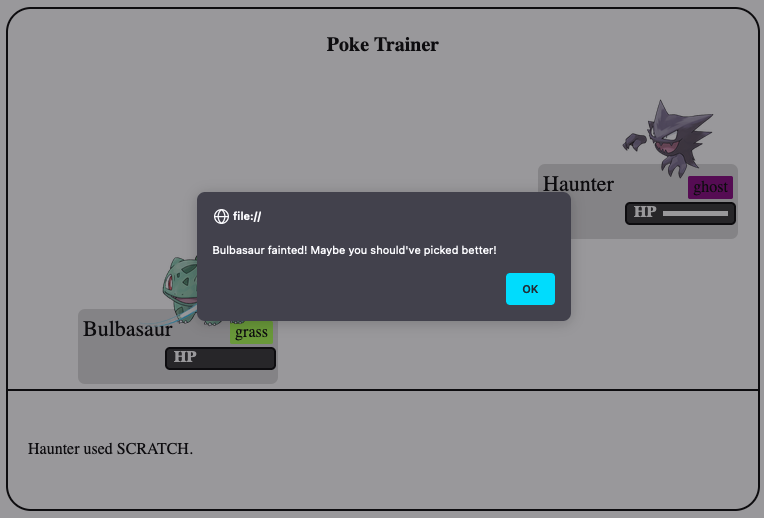

# Poké Trainer

### Images of working App

## Technologies

- HTML
- CSS
- JavaScript/
- [Pokemon API](https://pokeapi.co/)

<!-- Installation Instruction -->

To begin, fork and clone the repository. Open index.html in browser to begin game play.

<!-- Approach taken -->

<!-- Code snippets with explanation of code -->

<!-- Unsolved Problems -->

[x] Adding music for battle
[x] Add attack animation

<!-- Stretch Goals -->

[] Find an API that contains the type weaknesses so that it doesn't have to be hard coded into the JS file.
[] Allow users to select their own pokemon in battle
